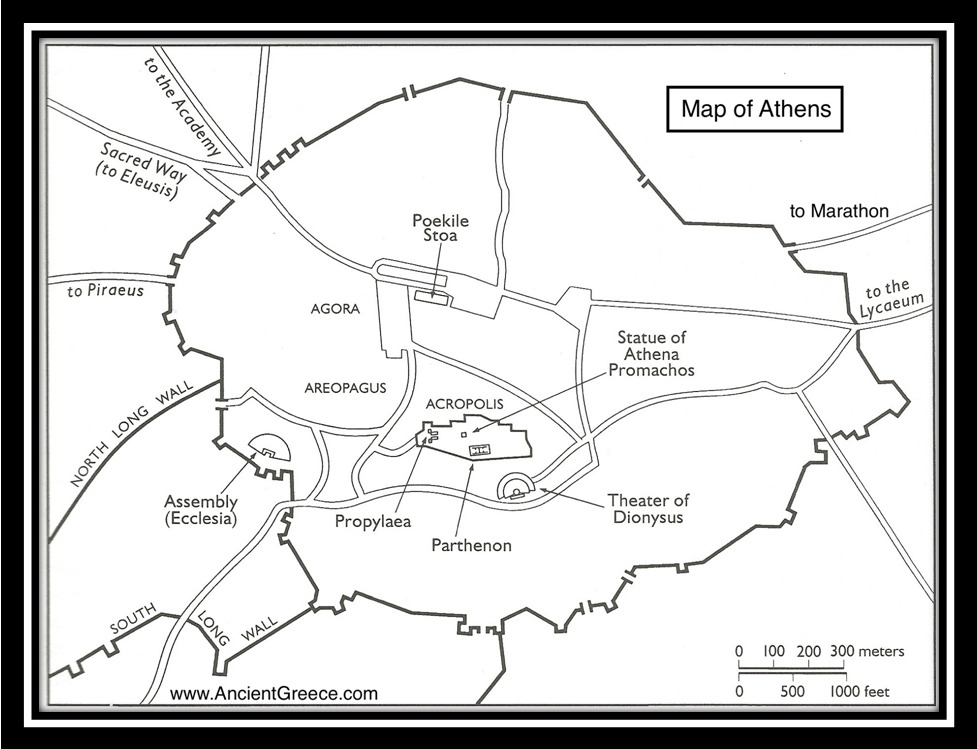

================================================================================
Classical Athens
================================================================================

Geography
================================================================================

The Agora
--------------------------------------------------------------------------------

.. image:: http://upload.wikimedia.org/wikipedia/commons/5/56/AncientAgoraofAthensColour.jpg
   :height: 400px

The agora was a central spot in ancient Greek city-states. The agora was the
center of athletic, artistic, spiritual, and political life of the city.

The Acropolis
--------------------------------------------------------------------------------

.. image:: http://upload.wikimedia.org/wikipedia/commons/thumb/c/c4/Akropolis_by_Leo_von_Klenze.jpg/640px-Akropolis_by_Leo_von_Klenze.jpg

The Aeropagus
--------------------------------------------------------------------------------

.. image:: http://upload.wikimedia.org/wikipedia/commons/thumb/7/7e/Areopagus_from_the_Acropolis.jpg/640px-Areopagus_from_the_Acropolis.jpg

The Lyceum
--------------------------------------------------------------------------------

The Lyceum was a gymnasium and before that a public meeting place in a grove of
trees in Classical Athens. The grove was named in honor of its patron Apollo
Lyceus or "Apollo in the form of a wolf".

Architecture
================================================================================

.. figure:: http://upload.wikimedia.org/wikipedia/commons/e/e9/Domus_romana_Vector002.svg

   A Roman domus. I think they had these in Greece as well?
