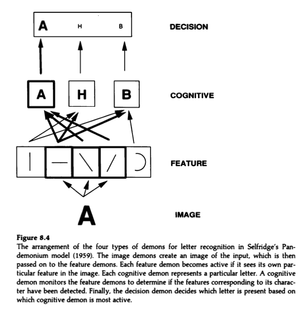

.. include:: index

================================================================================
Pandemonium architecture
================================================================================

The Pandemonium is a `computational model`_ of `pattern recognition`_ developed
by `Oliver Selfridge` in his 1959 paper `Pandemonium: A paradigm for learning`.
[1]_

Pandemonium architecture was one of the first `computational models` in `pattern
recognition`_. Though imperfect, it influenced the development of `connectionist
models`_, `artificial intelligence`_, and `word recognition`_ models.

.. [1] `Selfridge 1959`_
