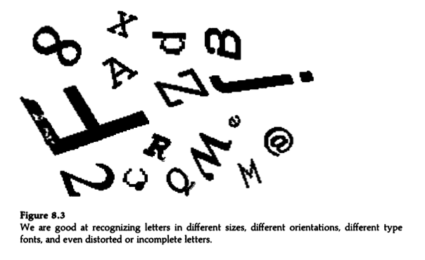

.. include:: index

================================================================================
Pattern recognition
================================================================================

Pattern recognition is ...

Pattern recognition is fundamental in such different domains as playing chess,
examining X-rays, and reading.

    I use the term "pattern recognition" to describe what is commonly meant by
    perception, recognition, identification, and categorization. [1]_

Perception_ describes our awareness of some environmental event.

Recognition means recognizing something we experienced previously.

Identification involves making a unique response to each unique stimulus.

Categorization means placing several noticeably different stimuli into the same
category.

For example, a child sees a dog, recognizes it as a dog she has seen before,
identifies it as Fido, and categorizes it as a dog.

Recognition, identification, and categorization appear to be central to
perceptual and cognitive functioning, and they appear to entail the same
fundamental processes.

Some approaches to pattern recognition include:

- `Template matching`_

- `Feature analysis`_

Memory_ is an essential component of pattern recognition because the current
stimulus pattern has to be compared against the recognizer's memory_ of previous
patterns.

----

    In psychology, pattern recognition, making sense of and identifying the
    objects we see is closely related to perception, which explains how the
    sensory inputs we receive are made meaningful. Pattern recognition can be
    thought of in two different ways: the first being template matching and the
    second being feature detection. A template is a pattern used to produce
    items of the same proportions. The template-matching hypothesis suggests
    that incoming stimuli are compared with templates in the long term memory.
    If there is a match, the stimulus is identified. Feature detection models,
    such as the Pandemonium system for classifying letters (Selfridge, 1959),
    suggest that the stimuli are broken down into their component parts for
    identification. For example, a capital E has three horizontal lines and one
    vertical line.

----

Prototype matching
================================================================================

One of the possible type of pattern memory is a set of prototypes. [1]_

The exact form such prototype descriptions might take in the mind is not known
and may never be known. However, the representation in memory_ must be
compatible with the percept_. Compatibility is necessary because the perceiver
must compare the information provided by the stimulus to some memory of the
prototypes or categories.

A prototype (or category) is a summary description of a meaningful pattern. Each
prototype is a description of the ideal feature values that a pattern should
have if it is a member of that category.

.. [1] `Massaro 1998`_
