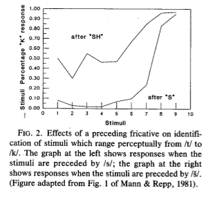

================================================================================
Coarticulatory influence
================================================================================

The effect that the pronunciation of some sound has on the next.

For instance, consider "foolish dancer" and "fearless dancer". In the former,
the rounding of the lips from "sh" extends to the following "d". In the latter,
the retracting of the lips from "s" extends to the "d".

Coarticulatory influences in speech result from vocal tract dynamics and are a
major source of variability in the speech signal.

