.. include:: index

================================================================================
Models for Reading Letters and Words
================================================================================

:Authors: Dominic W. Massaro

:Date: 1998

:Work: An Invitation to Cognitive Science - 2nd Edition

:Pages: 302-364 (63)

:Abstract:
    The goal of this chapter is to illustrate how developing and testing
    `computational models`_ can inform us about the psychological processes
    involved in perceiving, recognizing, and categorizing the world.

    To simplify the discussion, we focus on the question of how we perceive
    letters and words.

    This chapter promotes the value of computational models in the enterprise of
    understanding how humans accomplish feats such as pattern recognition.

    In the first few sections, Massaro reviews `pattern recognition`_,
    `computational models`_, and the two main approaches to `pattern
    recognition`_: `template matching`_ and `feature analysis`_.

    Then Massaro suggests that we test a core assumption of feature analysis:
    namely, whether feature detectors report discrete or continuous responses.

    To do this, he proposes an experiment using a rating task, where subjects
    are presented ambiguous letters on a ``c``-``e`` continuum and are asked to
    indicate where each test letter feel on a nine-point scale between ``c`` and
    ``e``. Massaro reviews the predictions of the discrete feature model and the
    continuous feature model, and then presents results that indicate the
    continuous feature model accurately predicts responses.

    In what follows, I show how both discrete and continuous feature recognition
    theories are consistent with the mean rating results shown in figure 7. Then
    we will see how extending the database and computational modeling can
    distinguish between the two alternatives.

.. contents::

.. sectnum::

Introduction
================================================================================
:Pages: 302-304 (2)

- When faced with a written word we seem to have no choice but to read it.
  (Stroop effect - 1935). Reading words is such an overlearned skill, it is not
  easily put on hold. Achieving this level of reading skill takes time. Reading
  is a remarkably complex skill.
  
- In addition to being experts in letter recognition, we are especially good at
  recognizing them when they spell words. Our knowledge of spelling and the
  context provided by other letters of a word help us recognize individual
  letters within words.

  .. image:: ../img/Massaro_1998_fig_1.png
     :align: center

Letter recognition
================================================================================
:Pages: 310-319 (10)

It has been hypothesized that feature detectors are binary: either a feature is
present or not. This assumption should be put to the test because it is can
central to how we think about feature. The alternative is that feature detector
detectors are continuous.

Fuzzy letters and continuous rating judgments
--------------------------------------------------------------------------------

Most studies of letter recognition do not address the assumption of discrete
features.

To test this idea, we want the subject to make errors.

One way to induce errors is to show a letter for a short duration followed by a
`visual mask`_. However, results of these experiment do not easily test whether
perception of features is continuous or discrete because the results are
consistent with either hypothesis.

----

Another approach is to crate ambiguous_ letters by varying the degree to which a
feature is present. For many pairs of letters, we can create ambiguous letters
that resemble both letters. For example, the lowercase letters ``c`` and ``e``
appear to differ in the presence of horizontal line feature for ``e`` but not
``c``. How readers process these ambiguous letters should help us decide whether
this feature is perceived discretely or continuously.

.. image:: ../img/Massaro_1998_fig_6.png
   :align: center

In an experiment addressing the issue, each of the six letters shown in figure
8.6 was presented seventy times in random order, and the subject categorized
each presentation as an ``e`` or a ``c``. The results show that letters on the
``c`` side of the continuum were consistently categorized as ``c`` and letters
on the ``e`` side of the continuum were consistently categorized as ``e``.

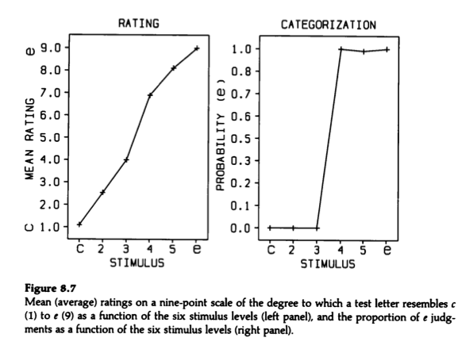

From this, it might be concluded that the horizontal line feature is perceived
discretely. However, this conclusion would not be justified because the
categorization task does not permit subjects to give a direct report of what
they saw.

.. todo: I do not understand why in figure 8.7 the probability go from 0 to 1.
   Surely, it would be slightly unequal?

----

Another possible task is to ask subjects where a present letters falls on a
continuous scale between ``c`` and ``e``. [*]_ The subject provided seventy
ratings for each of the six test letters.

.. list-table:: Letter-rating task
    :header-rows: 1
    :widths: 10 45 45

    - - 

      - Discrete feature model

      - Continuous feature model

    - - Assumptions

      - - Subjects recognize each stimulus presentation as ``c`` or ``e`` and
          nothing in between.

        - Perception_ is probabilistic. Probability is influenced by
          resemblance.

        - Predicts subjects would choose ratings toward the ``c`` end of the
          scale for the perception_ of ``c`` and vice-versa for ``e``.

      - - Subjects perceive the degree to which a letter resembles each
          alternative.

        - Expect a distribution of rating judgments due to random variability in
          perceptual memory or response systems.

        - Predicts a systematic and continuous change across the six test
          letters.

    - - Hypothetical distribution of rating responses

      - |Figure8|

      - |Figure10|

    - - Results

      - |Figure11|

      - |Figure12|

.. list-table:: Meaning rating responses
    :header-rows: 1

    - - Hypothetical

      - Observed

    - - |Figure9|

      - |Figure13|

Experimental test
--------------------------------------------------------------------------------

We can analyze the observed distributions of the rating responses.

As can be seen, the distributions of the observed ratings are unambiguously
characterized by the having a single peak as predicted by the continuous model.

Consider the third stimulus level on the ``c``-``e`` continuum. Figure 11 shows
that the subject consistently rated the stimulus as a four along the ``c``-``e``
continuum. As shown in figure 8.8, the discrete model would predict that the
subject should have rated some of the time toward the ``c`` end and some of the
time toward the ``e`` end of the ``c``-``e`` rating continuum.

In order to determine whether the observed distributions of the ratings were
best fit by the continuous or the discrete model, the two models were formulated
to predict the distributions of ratings. That is, instead of using the
hypothetical distributions, Massaro found the distributions for each model that
would do the best job of predicting the observed rating judgments.

The continuous model does a much better job of fitting the observed
distributions of ratings. We conclude that letter features are perceived
continuously rather than discretely.

**What is important for our purposes is that his conclusion required
computational modeling to provided a definitive test of a long standing
assumption about the processing of letter features.**

Multifactor experiments
================================================================================
:Pages: 319-321 (3)

In the ``c``-``e`` study, we varied just a single feature, and although we
described it as a test of whether features are perceived as discrete or
continuous, the results are consistent with both feature and template theories;
the results tell us only that subjects responded to the information in the task
as if it were continuous.

If we design our experiment to be somewhat more realistic, we should
systematically vary two or more features independently to try to isolate the
influence of each feature. Furthermore, we should also vary the degree to which
each feature is is present.

Two categories, ``G`` and ``Q`` were chose as the alternatives in a letter
processing task.

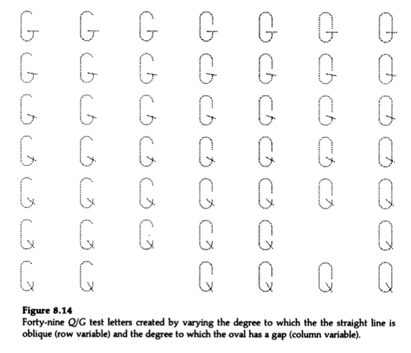

From a featural perspective:

1. ``Q`` has a closed oval and ``G`` has an open oval.

2. ``Q`` has an oblique line and ``G`` has a horizontal line.

We can create novel test letters by varying the degree to which each feature
resembles its normal appearance in the letters:

In a factorial experimental design with two factors, each level of one factor is
combined with every level of the factor.

`Massaro and Harry (1986)` carried out this experiment. In the categorization
task, the 49 test letter were presented 12 times for 400 ms in random order to
each of 9 subjects.

Models of recognition
================================================================================
:Pages: 321-338 (18)

Template model
--------------------------------------------------------------------------------

A template account of this task appears to have very little predictive power.

Each of the forty-nine test stimuli is a new holistic event and recognition
cannot be predicted on the basis of the two separate properties, gap size and
angle line.

This version of the template theory predicts a consistent division of the
forty-nine letters into two sets, but this predictions conflicts with the
variability of human nature; we can expect that a stimulus will not always
receive the same categorization response.

One place where variability might occur in a template model is in the decision
operations. For example, if decisions are based on a goodness-of-match rule
(RGR).

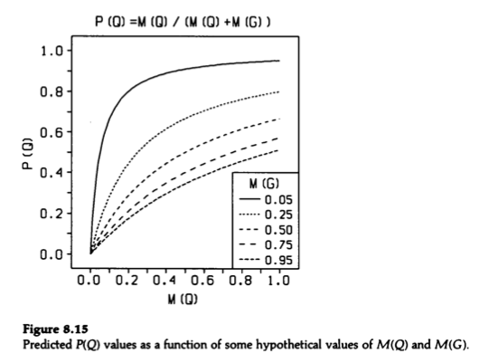

One justification of the RGR is the probability matching that is often
observed in decision making. The RGR also captures what appears to be a
reasonable relationship between stimuli and responses in pattern recognition.

Discrete feature model
--------------------------------------------------------------------------------

Elaborating the presumed operations
~~~~~~~~~~~~~~~~~~~~~~~~~~~~~~~~~~~~~~~~~~~~~~~~~~~~~~~~~~~~~~~~~~~~~~~~~~~~~~~~

One of the possible type of pattern memory is a set of summary descriptions of
the meaningful patterns. These summary descriptions are called "prototypes" or
categories and each prototype is a description of the ideal feature values that
a pattern should have if it is a member of that category. The exact form such
prototype descriptions might take in the mind is not known and may never be
known. However, the representation in memory_ must be compatible with the
percept_. Compatibility is necessary because the perceiver must compare the
information provided by the stimulus to some memory of the prototypes or
categories.

.. todo: Prototype-matching?

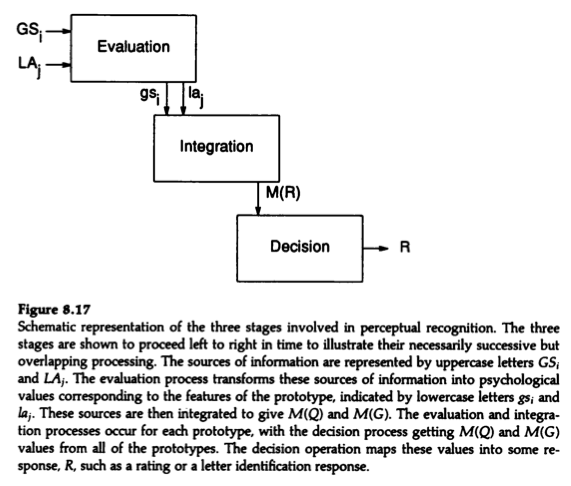

1. Evaluation: Evaluate the stimulus to determine the values of the
   features; which features are present and which are absent.

2. Feature integration: Compare each of the prototypes to the stimulus feature,
   and output a measure of how much each prototype matches the stimulus.

3. Decision: Select a response based on the outcome of integration. The decision
   operation might simply select the prototype or category with the best
   goodness of match.

The three operations between presentation of a pattern and its categorization as
can be formalized mathematically.

Free parameters and their estimation
~~~~~~~~~~~~~~~~~~~~~~~~~~~~~~~~~~~~~~~~~~~~~~~~~~~~~~~~~~~~~~~~~~~~~~~~~~~~~~~~

Fuzzy logical model of perception
--------------------------------------------------------------------------------

Benchmark measures of goodness of fit
~~~~~~~~~~~~~~~~~~~~~~~~~~~~~~~~~~~~~~~~~~~~~~~~~~~~~~~~~~~~~~~~~~~~~~~~~~~~~~~~

Context effects in pattern recognition
================================================================================
:Pages: 338-343 (6)

Test of the FLMP
--------------------------------------------------------------------------------

Sentence context in word recognition
--------------------------------------------------------------------------------

Artificial neural network models
================================================================================
:Pages: 343-356 (14)

Connectionist model of perception
--------------------------------------------------------------------------------

Interactive activation model
--------------------------------------------------------------------------------

IAM with input noise and best-one-wins decisions rule
--------------------------------------------------------------------------------

Justification of computational modeling
================================================================================
:Pages: 356-360 (5)

Difficulties in psychological inquiry
--------------------------------------------------------------------------------

Implications for psychological inquiry
--------------------------------------------------------------------------------

Metatheoretical issues and the computational approach
================================================================================
:Pages: 360-362 (3)

Identifiability issue
--------------------------------------------------------------------------------

Optimality of pattern recognition
--------------------------------------------------------------------------------

Footnotes
================================================================================

.. [*]
    In proposing this, I am assuming that asking for a continuous rating rather
    than a discrete categorization judgment does not change the underlying
    perceptual processes. I think of letter and word recognition as automatic.
    The nature of the response should not greatly influence the perceptual
    processing that leads to the response.

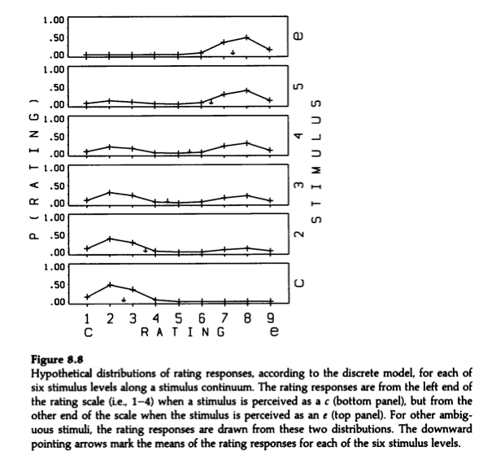

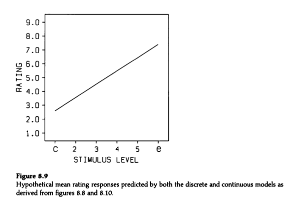

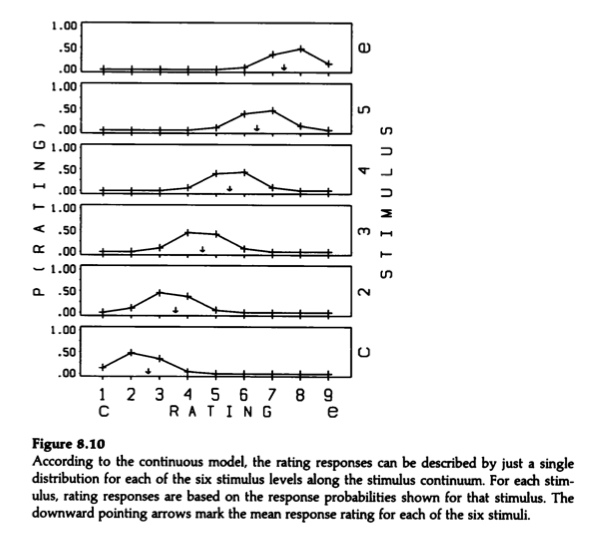

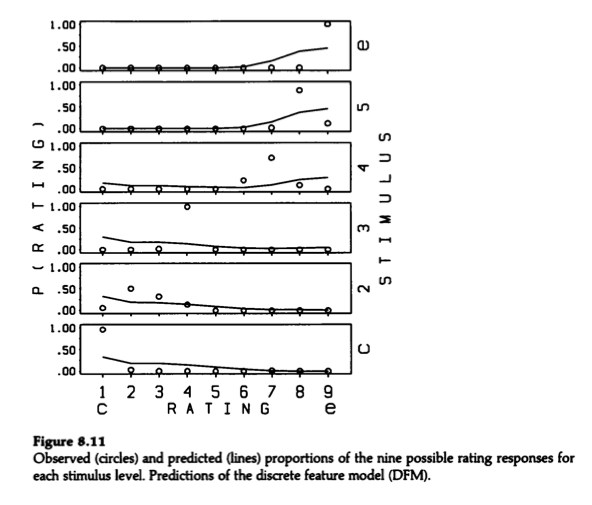

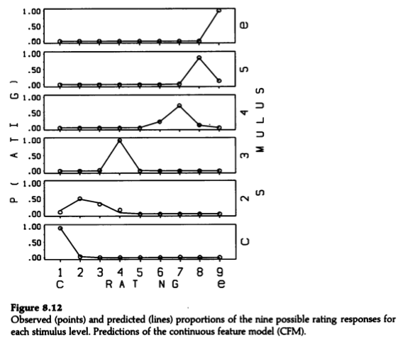

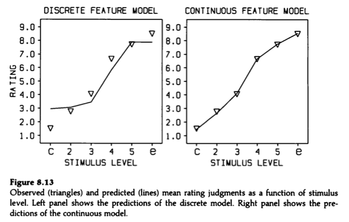

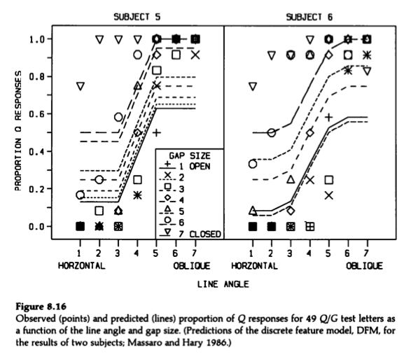

