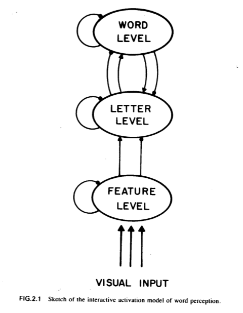
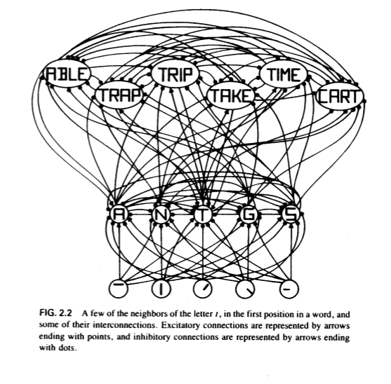
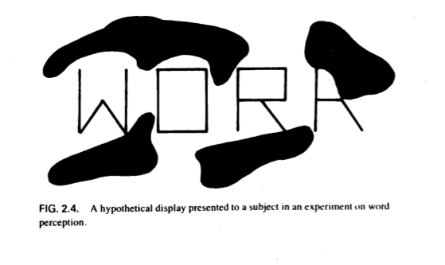
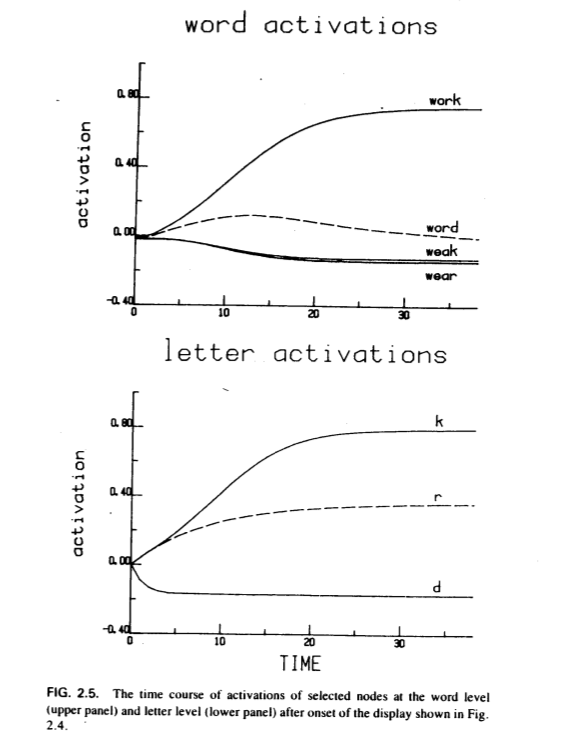
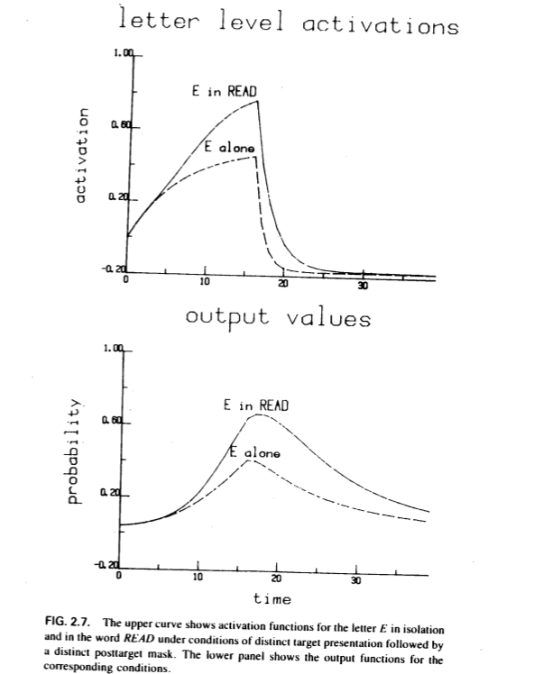

.. include:: glossaries/psycholinguistics.h
.. _reicher 1969: ../build/reicher_1969.html 

.. _rumelhart mcclelland 1981:

================================================================================
Interactive Processing through Spreading Activation
================================================================================

:Authors: David E. Rumelhart; James L. McClleand
:Date: 1981
:Book: Interactive Processes in Reading. Chapter 2.
:Pages: 37-60 (24)
:Abstract:
    ?

.. contents::

Introduction
================================================================================
:Pages: 37-38 (2)

A central issue in the development of a model of the reading process is *the way
the context in which a linguistic element is found affects the way that element
is processed and ultimately interpreted*.

The authors previously proposed an `interactive model`_, but:

1. It was very general

2. It suffered from a lack of direct connection to an empirical base, and

3. It suffered from a lack of specificity of how the brain might actually out
   such complex computations.
   
Here, the authors propose a model that addresses these concerns.

Some important facts about |WP|
================================================================================
:Pages: 38-43 (6)

`Reicher 1969`_ conclusively demonstrated that |LP|_ in |Ws| and |-Ws| is
dependent on |WC|_. [*]_

The literature provides several important clues to the processes at work in
|WP| that have been central to the development of our model:

1. |WP| seems to rely on the arrangement of |Ls| rather than familiar visual
   forms. [#]_

2. |~Ws| have |Wa| over |-Ws| and |1Ls|. [#]_

3. |WA| is greatly affected by the details of the visual conditions used. (see:
   the word advantage and its dependence on masking)

These findings seem to be compatible with a model in which partial preattentive
activations of |Ls| give rise to the activation of |W|, which in turn
produce feedback reinforcing the |L| activations.

The model
================================================================================
:Pages: 43-50 (8)

Here we review the model we have worked out to achieve this result.

Assumptions:

1. Perception consists of a series of interacting levels, each level
   communicating with those immediately above and below it. [*]_

2. Communication proceeds through a spreading activation mechanism in which
   activation at one level "spreads" to neighboring levels.

3. Communication consists of messages that either |+|_ or |-|_.

4. Intralevel relationships that |-|_ one another represent a kind of
   relationship in which certain units at the same level compete. [#]_  
   
Although we assume that there are many levels that might be important in |WP|,
we have found that we can account for many of the major phenomena by considering
only the interactions between the |LL| and |WL|. Thus, we describe the
model only for these two levels, and assume that other levels merely generate
input to these.

Specific assumptions
--------------------------------------------------------------------------------
:Pages: 43-46 (4)

For every relevant unit in the system there is an entity called a "node".

|W| nodes are located at the |WL| and |L| nodes are located at the |LL|.

Each node has two-way connections to a number of other nodes, both within levels
and between adjacent levels.

Connections within the |WL| mutually |-|_ since only one word can occur any one
time. Connections between the |WL| and |LL| may either |+|_ or |-|_ depending on
whether the |L| appears in the |W| at the relevant index.

Each node has a momentary level of activation. Every moment, the influences of
a node's `active`_ `neighbors`_ are combined by a simple weighted average to
yield a net input to the node, which drives its activation.  In the absence of
`active`_ `neighbors`_, a node's activation decays to an inactive state.

Upon presentation of a stimulus, a set of features inputs are made available to
the system. [#]_ As features are detected, they |+|_ |LL| nodes that contain
them and |-|_ those that do not. The probability of detection and the degree to
which a feature can |+|_ or |-|_ represents the clarity of the visual display.

The operation of the model
--------------------------------------------------------------------------------
:Pages: 46-46

Now we consider what happens when an input reaches the system.

Assume that the entire system is in a quiescent state and that each node is at
resting level.

The presentation of a stimulus initiates a chain in which certain features are
extracted which |+|_ and |-|_ |LL| nodes, causing some to activate. These |L|
nodes, in turn, |+| |WL| nodes which contain them and |-|_ |WL| nodes which do
not.

Meanwhile, |LL| nodes |-|_ each other, with the strongest ones getting the
upper-hand. As |WL| nodes become active, they in turn |-|_ each another and |+|_
and |-|_ the |LL| nodes.

If the input features seem to form a particular |W|, the system will converge
rapidly on the appropriate |Ls| and |W|. If not, competition will ensue; and
perhaps no |Ls| nor |W| will dominate the others. The details of the process are
greatly affected by the values of various parameters of the model.

Simulations
--------------------------------------------------------------------------------
:Pages: 46-49

The authors have simulated the model using a computer with several simplifying
assumptions:

1. The simulation of the model operates in discrete time slices, or ticks.

2. The degree to which one node may |+|_ or |-|_ another depends only on the
   levels at which the nodes are located.

3. We restrict stimuli to four-letter words.

On making responses
--------------------------------------------------------------------------------
:Pages: 49-50

One of the more problematic aspects of a model such as this one is a
specification of how these relatively complex patterns of activity might be
related to the content of percepts and the sorts of response probability as
observe in experiments.

The model assumes that the percept corresponds to a temporal integration of the
pattern of activation over all the nodes. The integration process is assumed to
occur slowly enough that very brief activations may come and go without
necessarily entering perceptual experience or being accessible for purposes of
responding; the longer an activation last, the more likely it is to be
reportable.

Applications of the model to the literature
================================================================================
:Pages: 50-58

Below we try to illustrate a few of the major features of the model's operation
in account for of the most important facts.

The word advantage and its dependence on |VMASK|
--------------------------------------------------------------------------------
:Pages: 51-51

.. TODO: Come back to this section. It's unclear to me what the point is.

:Preface: I don't really understand why there is a difference. I think it is
          because there isn't much activation going in the no-mask condition
          for probabilities to even be formed.

Researchers have found that |WA| of |Ws| over |1Ls| and |-Ws| in
`forced-choice`_ tasks is greatly affected by visual conditions. A variety of
different interpretations have been offered for the dependence of the |WA| on
|VMASK|.

============    =========  =======  ==================
Display         |VMASK|_?  |WA|     Performance Limit
============    =========  =======  ==================
Dim or brief    No         Minimal  Extracted |VI|
Clear           Yes        Large    Stimulus duration
============    =========  =======  ==================

Assume target presentation results in mask conditions in complete feature
extraction.

- In the no-mask condition, word-level feedback reinforces |Ls| consistent with
  the |S|'s |WK| and extracted |VI|

- In the mask condition, word-level feedback reinforces |Ls|.

.. These are identical?
.. It's not clear to me why in the first case, there is no word advantage. In
   the second, it is clear-- word activation reinforces |Ls|. This would also
   increase the strenghth of |~Ws|

Possibilities:

1. The fact that the stimulus is a word makes it possible to maintain
   activations of a representation capturing the information in the display
   longer than would otherwise be the case, thereby increasing the chance
   that the |S| would have enough time to translate the activated
   representation into a form suitable for overt report.

   The feedback mechanism we have been describing might have just such an
   effect; word-level feedback could keep the representations of the |L| active
   longer in the face of |VMASK| than would otherwise be the case.

Perception of pronounceable nonwords
--------------------------------------------------------------------------------
:Pages: 51-54

The model explains why |LP| in |~Ws| is greater than |-W| and |1L|. Namely, as
|~Ws| are similar to |Ws|, |W| nodes will reinforce |Ls| in |~Ws|, which they
will not do for |-W| nor |1Ls|.

.. TODO: I do not understand how the model explains why expectation has any
         effect. I think what is being gotten at is that the model might change
         based on expectations, in one case with strong inhibitory effects
         (representing the expectation that only words will be presented) and
         one with weak inhibitory effects (representing the expectation of
         |~Ws|) (they later call this letter-word inhibition)

Studies now show that |LP| in |~W| is facilitated only if |S| is aware that the
list of stimuli may contain |~W|. Interestingly, |LP| in |W| does depend on
expectation in this way.

Assume that the result depends on the ratio of |+| to |-| in the influence of
activation at the |LL| on activation of the |WL| 

The flexibility of the perceptual system
--------------------------------------------------------------------------------
:Pages: 54-54

The model captures the effects of the visual conditions of the stimulus
presentation and the expectations of the subject for what types of material will
be shown.

Other effects in the literature
--------------------------------------------------------------------------------
:Pages: 54-56

There are a number of other phenomena in the literature that we have been able
to account for with our model.

- It was recently found that the letter ``S`` is no more easily seen in ``SHIP``
  than in ``SINK`` even though the context in the first case is consistent with
  (that is, forms a word with) only 3 possible letters, whereas that context in
  the latter case is consistent with 12 to 14, depending on what is counted as a
  word.
  
  - Only words were used in the experiment, so we could expect a high value of
    letter-word inhibition.
  - Visual conditions were distinct target / patterned mask.

  Under these conditions, only the nodes for the letters actually shown receive
  net excitation on the basis of the stimulus input, and the only the node for
  the single word containing all the active letters receives net excitation from
  the output of the active letters.

  Under these circumstances, the numbers of words similar to the target is
  irrelevant, because none of the corresponding nodes receive any net
  excitation. Thus, the model produces no constraints either.

- It was recently found that the word advantage over single letters is greatly
  reduced when the patterned mask contains letters rather than
  non-letter-pattered elements. It did not matter whether or not the letter
  spelled a word.

  In the model, this result comes about only in cases where the input was strong
  and of very high quality, so that the effect of feedback from the word level
  is to increase the persistence rather than the height of the activation
  function. The reason why the presence of letters in the mask reduces the word
  advantage is that the letters in the mask quickly produce activations of their
  own which interfere with the readout process.

  (Recall that the probability of correct readout depends on the strength of the
  correct node, divided by the sums of the strength of the other nodes)

  In essence, the idea is that in the case of words, there is still something
  left for the mask letters to interfere with, but this is not so (or, rather,
  is so to a very limited extent) in the case of single letters.

  In order to get the model to behave this way, we found it was necessary to
  restrict the effect of the mask on active letter representations while making
  the excitatory effect of the mask letters on the nodes for the letter in the
  mask quite strong.
  

Context enhancement effects
--------------------------------------------------------------------------------
:Pages: 56-58

.. Not interesting

Summary and conclusion
================================================================================
:Pages: 58-59

A complete model of the role of context in |LP| would be considerably more
complex.

The processes carried out by the model are clearly not beyond the capability of
simple neural circuits that we already know exist in the brain and nervous
system.

Through the use of computer simulation procedures we have been able to generate
specific predications from out model for nearly all the important phenomena of
word perception. For the most part, these predictions have compared very
favorably with observed results in a wide range of experimental studies.

Footnotes
================================================================================

.. [*]
    Historical findings support the view that |LP|_ in |Ws| and |-Ws| is not
    independent of |WC|. [1]_ However, it is possible to interpret them in terms
    of `postperceptual guessing` [2]_ or `postperceptual forgetting processes`
    [3]_.  `Reicher 1969`_ eliminated these nonperceptual interpretations and
    conclusively demonstrated that |WC|_ facilitates |LP|_. [4]_

.. [*]
    In general, of course, a given level may have more than one level
    immediately above or below it, but for simplicity we now consider the case
    in which there is a linear ordering of levels.

.. [1]
    - |WP|_ is possible in conditions where accurate |LP|_ is not.

    - At a given exposure level, |WP|_ is more accurate for common |Ws| than
      uncommon |Ws|.

    - |LP|_ is more accurate in |~Ws|_ than |-~Ws|_.

.. [2]
    Word perception might be better than nonword perception simply because
    |Ss| could guess imperfectly perceived words based on their knowledge of
    English.

.. [3]
    |WP| might be better than |-WP| simply because a large number of unrelated
    |Ls| might pose a memory load that would limit accuracy of identification,
    even if all the |Ls| were perceived accurately

.. [4]
    Postperceptual guessing can be eliminated because |LP| was more
    accurate in words despite the fact that both alternatives would have formed
    a word.

    Postperceptual forgetting can be eliminated because |LP| was more accurate
    in words than with single |Ls|.

.. [#]
    Recently, researchers found that recognition of familiar visual forms does
    not facilitate |WP|_ over |-WP|_, which suggests that |WP|_ relies on the
    arrangement of |LS|.

    This seems to create a paradox: If |WP|_ relies on the arrangement of |LS|,
    then it seems to follow that |WP|_ relies on the results of |LP|_. But if
    |WC|_ facilitates |LP|_ as in `Reicher 1969`_, then it seems to follow that
    |LP|_ relies on the results of |WP|_. The paradox can be resolved if we
    consider that |LP|_ may be incomplete when interacting with |WK|. Perhaps
    what |WK| does is allows us to reinforce partial |LP| that is consistent
    with |Ws| in our vocabulary.

.. [#]
    Researchers have found that |~Ws| have |WA|_ over |-Ws| and |1Ls|.

    One view that has often been taken concerning these findings holds that
    |WK| is not directly used in |WP|, but the findings that |W| have |WA| over
    |~W| refute that.

    **Would it be possible to get by with a model that makes use of knowledge of
    specific words only?**

    Recent work on the process of constructing pronunciations of |~Ws| suggested
    to us that it might. Research has found that when constructing
    pronunciations of both |Ws| and |-Ws|, our knowledge of the pronunciation of
    specific words similiar to the target word seem to influence the time and
    accuracy of our responding, which suggests pronunciations of |~Ws| are
    synthesized out of activations of pronounciations of |Ws| that are similar
    to the target. (If not enough activations of pronunciations of |Ws| are 
    available, the word is not pronouncable.)
    
    A similar process could be happening in |~WP|, and if so, we might be able
    to explain |WP| and |~WP| based on |WK|.

.. [#]
    Thus, for example, since a string of four |Ls| can be interpreted as, at
    most, one four-letter |W|, various possible |Ws| mutually inhibit each other
    and in that way compete as possible interpretations of the string.

.. [#]
    For simplicity, inputs consist of letters written in a simple geometric
    font.

    .. image:: ../img/rumelhart_mcclelland_1981_fig_2.3.png
       :height: 200px

.. [#]
    This characterizes most of the early work (pre-1970) on word perception.

Glossary
================================================================================

.. _interactive model:

Interactive model
    A model in which data-driven, bottom-up processing combines with
    conceptually-driven, top-down, processing to cooperatively determine the
    most likely interpretation of the input, proposed by Rumelhart (1977) to
    explicate the role of context during reading.

    Roughly speaking processing in an interactive model proceeds in the
    following way:

    1. The reader begins with a set of expectations about what information is
       likely to be available through visual input.
    2. These expectations, or initial hypotheses, are based on our knowledge of
       the structure of letters, words, phrases, sentences, and larger pieces of
       discourse, including nonlinguistic aspects of the current contextual
       situation.
    3. As visual information from the page begins to become available, it
       strengthens those hypotheses that are consistent with the input and
       weakens those that are inconsistent.
    4. The stronger hypotheses, in turn, make even more specific predications
       about the information available in the visual input.
    5. To the degree that these hypotheses are confirmed, they are further
       strengthened, and the processing is faciliated.

.. _interactive processing:

Interactive processing
    A form of cooperative processing in which all knowledge at all levels of
    abstraction can come into play in the process of reading and comprehension.

.. |LP| replace:: letter perception
.. _LP:
.. _letter perception:

Letter perception
    The process of recognizing letters.

.. |~W| replace:: pseudoword
.. _~W:
.. |~Ws| replace:: pseudowords
.. _~Ws:
.. |-~W| replace:: non-pseudoword
.. _-~W:
.. |-~Ws| replace:: non-pseudowords
.. _-~Ws:

Pseudoword
    A pronounceable nonword.

.. |WA| replace:: word advantage
.. _WA:

Word advantage
    The perceptual advantage of |Ws| over |-Ws| or |1Ls|.

.. |WC| replace:: word context
.. _WC:
.. _word context:

Word context
    A context containing a recognized word.

.. |WP| replace:: |W| perception
.. _WP:
.. |-WP| replace:: |-W| perception
.. _-WP:
.. |~WP| replace:: |~W| perception
.. _~WP:
.. |-~WP| replace:: |-~W| perception
.. _-~WP:
.. _word perception:

Word perception
    The process of recognizing words.

.. |WK| replace:: word knowledge
.. _WK:
.. _word knowledge:

Word knowledge
    Information about the structure of words, including the arrangement of
    letters and the statistical frequency of letters co-occurring in a word.

.. |+| replace:: excite
.. _+:

|+|
    To increase the activation level of some entity

.. |-| replace:: inhibit
.. _-:
.. _- message:

-
    To decrease the activation level of some entity

.. _neighbors:

Neighbors
    The set to which a node connects.

.. _active:

Active node
    A node with a positive degree of activation.

.. |WL| replace:: |W|-level
.. |LL| replace:: |L|-level
